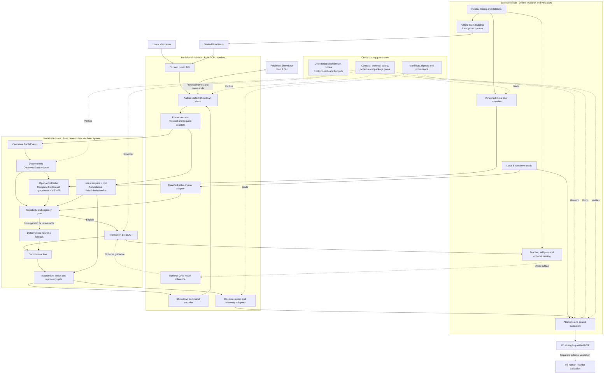

# BattleBelief

An open-source Pokémon Singles research bot for decision-making under hidden
information.

> **Status:** M1 protocol-safe prototype complete. The runtime can execute one
> direct Gen 9 OU challenge with a deterministic heuristic policy. Search,
> belief, training, ladder automation, engine parity, strength, and MVP claims
> are not implemented. Observed live public-protocol coverage is not
> established.

## Target architecture

> This diagram shows the planned end-state architecture. The implementation
> status and currently supported capabilities are documented above.



The diagram shows the complete decision path:

```text
Showdown wire
→ canonical events and public state
→ open-world belief
→ eligibility
→ Information-Set DUCT or heuristic fallback
→ independent safety gate
→ validated Showdown command
```

It also shows the offline path through the oracle, replay data, meta priors,
optional training, later team-building, and sealed evaluation. The separation
between `battlebelief-core`, `battlebelief-runtime`, and `battlebelief-lab`
remains intact.

BattleBelief targets current Smogon Gen 9 OU first. Teams are fixed before a
battle; offline team-building and in-battle decision-making are separate
systems.

## Research thesis

BattleBelief investigates whether an explicit open-world belief over complete
hidden sets, combined with information-set DUCT and an authoritative Showdown
action-safety gate, improves Gen 9 OU decisions over pre-specified heuristic,
determinization, and closed-world baselines under fixed CPU and
reproducibility budgets.

The project develops and measures one layer at a time. Runtime infrastructure,
search, belief, and optional models must each earn further complexity through
pre-specified comparisons and controlled ablations. Formal preregistration
begins only after M1.5 introduces the corresponding versioned registration
artifact. See the
[research strategy and experiment sequence](docs/roadmap/research-strategy-and-experiments.md).

## Current milestone

M1 delivered a protocol-safe, heuristic Gen 9 OU prototype. The implementation
on `main` includes:

- immutable battle events, visible state, and deterministic reduction;
- normalized decision requests and conservative safe submission sets;
- request reconciliation, deterministic heuristic selection, and an
  independent action-safety gate;
- room-preserving frame decoding and strict Showdown protocol parsing;
- request reading, command encoding, and packed-team loading;
- authenticated Showdown WebSocket connectivity with classified transport
  failures;
- request-driven `BattleSession` execution with freshness checks, pending-state
  reconciliation, and `rqid`-bound `/choose` dispatch;
- direct Gen 9 OU challenge coordination with single-reader room handoff;
- a secrets-safe outgoing challenge CLI with pre-network validation;
- visible protocol- and action-safety acceptance smokes in the stable
  `pr-gate`; and
- lockstep package version `0.2.0` with an M1 runtime capability status.

The measured [M1 protocol-safe prototype evidence](docs/operations/m1-protocol-safe-evidence.md)
records the synthetic coverage, checks, and explicit non-claims. The measured
[M1.5 harness and baseline-registration evidence](docs/operations/m1-5-measurement-harness-evidence.md)
records the frozen registration, deterministic synthetic runs, and acceptance
checks. Observed live measurement coverage remains unestablished. The next
planned milestone is M2; no strength, parity, release, or MVP claim is made.

## Packages

- `battlebelief-core`: pure immutable domain and application logic; currently
  includes protocol-state reduction, decision requests, reconciliation,
  deterministic policy, and action safety
- `battlebelief-runtime`: public live adapters and CLI; currently includes
  Showdown framing, parsing, requests, command encoding, packed teams,
  authenticated connectivity, the single-room `BattleSession`, direct-challenge
  coordination, and the secrets-safe challenge CLI
- `battlebelief-lab`: offline oracle, data, training, evaluation, and reporting
  work for later milestones

The package boundaries are defined in
[`docs/architecture/code-boundaries.md`](docs/architecture/code-boundaries.md).

## Documentation

Start with [`docs/README.md`](docs/README.md). A green `main` is an integration
claim only; it is not a strength, parity, release, or MVP claim.

## License

Source code is licensed under Apache-2.0. Datasets and model artifacts may have
different licenses and are documented separately.

BattleBelief is an unofficial research project and is not affiliated with
Nintendo, Game Freak, Creatures Inc., Smogon, or Pokémon Showdown.
