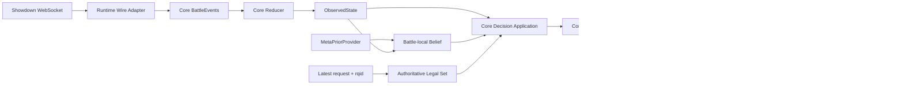

# Systemüberblick



## Zustandswahrheit

Kanonische Events und der deterministische Core-Reducer sind die einzige Quelle
des sichtbaren Battle-Zustands. Belief und Decision interpretieren keine
Showdown-Wire-Zeilen.

Der aktuelle `|request|`-Payload samt `rqid` bleibt parallel die autoritative
Quelle der aktuell erlaubten eigenen Aktionen.

## Engine-Rollen

- Pokémon Showdown: Oracle, Regeln, Legalität, Differentialtests und lokale
  Release-Holdouts.
- `poke-engine`: schneller Search-Simulator innerhalb nachgewiesener
  Capabilities.
- Legal-/Heuristikfallback: Livepfad bei fehlender Eligibility; Teil des
  Gesamtsystems und der primären Winrate.

## Offline, Snapshot und Battle

```text
Offline:
  Replays / Self-Play / kuratierte Daten
  → Parquet + DuckDB
  → versionierter, content-addressed Meta-Snapshot

Runtime:
  Snapshot-Artefakt validieren und öffnen
  → speicherneutrale MetaPriorSnapshot-Sicht für den Core

Battle:
  statisches Snapshot-Wissen teilen
  → kleines battle-lokales Working Set
  → entscheidungslokale Search-Projektion
  → Belief und Search ohne SQL- oder Dateizugriff im Hot Path
```

Das konkrete Runtime-Artefakt ist nicht vorab auf SQLite, Arrow oder ein
eigenes Binärformat festgelegt. Dateiformat, Memory Mapping und
Low-Level-Repräsentation werden durch einen reproduzierbaren Benchmark gewählt.
Die fachliche Grenze und die Lebensdauern werden in
[Memory-Hierarchie und battle-lokale Working Sets](memory-hierarchy.md)
erklärt.

## Zugehörige Verträge und Architektur

- [Codegrenzen](code-boundaries.md)
- [Memory-Hierarchie und battle-lokale Working Sets](memory-hierarchy.md)
- [Protocol und State](../contracts/protocol-state.md)
- [Legal-Action und Fallback-Safety](../contracts/legal-action-safety.md)
- [Engine-Capabilities](../contracts/engine-capabilities.md)
- [Belief und Open World](../contracts/belief-open-world.md)
- [Search-v0](../contracts/search-v0.md)
