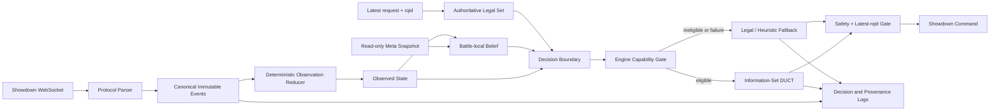

# Pokémon Singles Bot – Planungs- und Architekturvertrag

**Status:** genehmigter, eingefrorener Gesamtentwurf  
**Datum:** 29. Juli 2026  
**Designrevision:** 2 – Drei-Pakete-Monorepo und modulare Dokumentation  
**Initiales Zielformat:** aktuelles Smogon Gen 9 OU  
**Projektumfang:** ausschließlich Pokémon Singles; kein VGC und kein Doubles  
**Core-Lizenz:** Apache-2.0  

## 1. Zweck dieses Dokuments

Dieses Dokument ist die verbindliche Planungsgrundlage für einen von Beginn an
öffentlichen und quelloffenen Pokémon-Singles-Bot. Es legt fest:

- welche Spielstärke der erste MVP nachweisen muss;
- wie technische Korrektheit, Forschungsqualität und öffentliche Spielstärke
  getrennt gemessen werden;
- welche Rollen Pokémon Showdown und `poke-engine` besitzen;
- wie Entscheidungen unter versteckter Information getroffen werden;
- wie Replaydaten, Search Teacher, Self-Play und optionale Modelle verwendet
  werden;
- wie Teams offline gebaut und vor dem Battle versiegelt werden;
- wie Repository, CI, Sicherheitsregeln, Herkunft und Lizenzen organisiert
  werden;
- welche messbaren Gates jede Roadmapstufe bestehen muss.

Vorstufen heißen **Prototyp** oder **MVP-Kandidat**. Nur ein Release, dessen
präregistrierte Holdout-Untergrenze mindestens 70 Prozent beträgt und das alle
Safety-, Provenance- und Reproduzierbarkeitsgates besteht, darf **MVP** heißen.

## 2. Verbindlicher Scope

### 2.1 Im Scope

- Pokémon Singles;
- zunächst aktuelles Gen 9 OU;
- festgelegte Teams, die vor Battlebeginn vollständig feststehen;
- Battle-Entscheidungen unter unvollständiger Information;
- adaptive Reaktion auf Reveals und gegnerisches Verhalten innerhalb des
  laufenden Battles;
- lokale Showdown-Simulation als Oracle;
- `poke-engine` als schneller Suchsimulator, soweit die konkrete Stellung durch
  ein Capability-Gate zugelassen ist;
- Information-Set DUCT als Search-v0;
- optional Policy-/Value-Modelle, wenn sie in einer Ablation einen messbaren
  Mehrwert liefern;
- öffentliche Nutzung mit leichtem CPU-Runtime-Pfad;
- spätere Erweiterung auf weitere Singles-Formate, jeweils mit eigenem Claim.

### 2.2 Nicht im MVP

- Doubles oder VGC;
- Team-Erzeugung während des Battles;
- globale Online-Gewichtsänderungen während einer Evaluation;
- Cross-Battle-Gegnerprofile als notwendiger MVP-Bestandteil;
- Training durch massenhaftes Spielen auf der öffentlichen Ladder;
- ein LLM im Live-, Trainings- oder Analysepfad;
- eine eigene vollständige Pokémon-Mechanikengine;
- ein Strength-Claim, der aus grünem CI, Self-Play oder Peak-Elo abgeleitet wird.

### 2.3 Spätere Erweiterungen

- gegnerspezifische, datenschutzbewusste Cross-Battle-Priors;
- Regret Matching beziehungsweise Exp3 als Suchablation;
- größere Policy-/Value-Modelle;
- tieferer oder selektiverer Search;
- offline arbeitender Team-Builder;
- weitere Singles-Tiers und Generationen.

OU-Ergebnisse werden niemals auf ein anderes Format übertragen. Jedes Format
benötigt eigenen Ruleset-Snapshot, Capability-Audit, Meta-Snapshot, Team-Pool,
Holdout und Strength-Claim.

## 3. Leitende Architekturentscheidungen

1. **Showdown ist das Oracle.** Mechanik, Legalität, lokale Holdouts und
   Differentialtests werden gegen einen gepinnten Pokémon-Showdown-Commit
   definiert.
2. **`poke-engine` ist ein kontrollierter Surrogat-Simulator.** Es wird nur
   genutzt, wenn Artefakt, Buildfeatures, Adapter und alle für die Stellung
   benötigten Mechaniken durch ein versioniertes Manifest zugelassen sind.
3. **SQL entscheidet nicht.** Ein read-only SQLite-Snapshot liefert Meta-Priors.
   Battle-State, Belief und Search leben im RAM. Große Replayanalysen verwenden
   Parquet und DuckDB.
4. **Memory liefert nur Priors.** Kein gespeicherter Eintrag darf direkt einen
   Move auswählen.
5. **Search-first, ML nur bei Evidenz.** Ein search-only Bot darf den MVP bilden.
   Ein Modell wird nur aufgenommen, wenn es Stärke erhöht oder bei
   nachgewiesener Nichtunterlegenheit die Livekosten klar senkt.
6. **Feste Teams für den MVP.** Team-Building ist ein eigenes Offline-System und
   wird getrennt von Battle-Entscheidungen evaluiert.
7. **Keine stillen Approximationen.** Unbekannte Protokollereignisse,
   Engine-Capabilities, Schemaabweichungen und Artefaktmismatches führen
   fail-closed zu einer klassifizierten Reaktion.
8. **Claims gehören zu Snapshots.** Kein Ergebnis gilt allgemein für
   „Gen 9 OU“, sondern für einen dokumentierten Ruleset-, Daten-, Team-, Policy-
   und Evaluationsstand.

## 4. Systemarchitektur und Datenfluss



### 4.1 Eine Zustandsquelle

Der kanonische Eventlog und der deterministische Reducer sind die einzige
Quelle des sichtbaren Battle-Zustands. Weder `belief` noch `decision` dürfen
rohe WebSocket-Nachrichten selbst interpretieren.

Der aktuelle `|request|`-Payload samt `rqid` ist parallel dazu die autoritative
Quelle für die aktuell erlaubten eigenen Aktionen. Ein rekonstruierter Zustand
ersetzt diesen Legalitätsvertrag nicht.

### 4.2 Drei separat installierbare Python-Pakete

```text
packages/
├─ pokemonbot-core/
│  └─ src/pokemonbot_core/
│     ├─ domain/
│     │  ├─ events/
│     │  ├─ state/
│     │  ├─ actions/
│     │  ├─ belief/
│     │  ├─ teams/
│     │  └─ schemas/
│     ├─ ports/
│     │  ├─ battle_transport
│     │  ├─ transition_model
│     │  ├─ meta_prior_provider
│     │  ├─ policy_value_evaluator
│     │  ├─ trace_sink
│     │  ├─ clock
│     │  └─ random_source
│     └─ application/
│        ├─ battle_session/
│        ├─ observation/
│        ├─ decision/
│        ├─ search/
│        ├─ engine_eligibility/
│        └─ safety/
│
├─ pokemonbot-runtime/
│  └─ src/pokemonbot_runtime/
│     ├─ adapters/
│     │  ├─ showdown_protocol/
│     │  ├─ showdown_client/
│     │  ├─ poke_engine/
│     │  ├─ sqlite_meta/
│     │  ├─ model_inference/
│     │  ├─ team_files/
│     │  └─ telemetry/
│     ├─ public_api/
│     ├─ testing/
│     ├─ composition/
│     └─ cli/
│
└─ pokemonbot-lab/
   └─ src/pokemonbot_lab/
      ├─ oracle/showdown/
      ├─ datasets/
      ├─ replay_mining/
      ├─ teacher/
      ├─ selfplay/
      ├─ training/
      ├─ evaluation/
      └─ reporting/

tests/
├─ contracts/
├─ integration/
├─ differential/
└─ release/

configs/
├─ formats/snapshots/
├─ beliefs/
├─ teams/
└─ evaluation/

manifests/
├─ datasets/
├─ engines/
├─ models/
└─ experiments/

docs/                  # modularer, autoritätsgestufter Dokumentationsbaum
```

Die Pfeile bedeuten **„darf importieren“**:

```text
pokemonbot-runtime ──────► pokemonbot-core
pokemonbot-lab ──────────► pokemonbot-core
pokemonbot-lab ──────────► pokemonbot-runtime
```

Damit gilt:

```text
core imports:    weder runtime noch lab
runtime imports: core, niemals lab
lab imports:     core und ausschließlich freigegebene Runtime-APIs
```

Das Lab darf aus Runtime nur `pokemonbot_runtime.adapters`,
`pokemonbot_runtime.testing` und `pokemonbot_runtime.public_api` verwenden.
Private CLI-, Composition- oder Implementierungsmodule sind keine Lab-API.

### 4.3 Core-Reinheit

Core darf Standardbibliothek, bewusst genehmigte kleine Typ- oder
Validierungsbibliotheken, unveränderliche Domainobjekte, Ports, Search,
Belief, Reducer, Safety, Eligibility und kanonische Schemas kennen.

Core darf nicht kennen:

- WebSockets oder Showdown-Wire-Zeilen;
- Dateipfade oder Umgebungsvariablen;
- SQLite, DuckDB oder PyArrow;
- `poke-engine`;
- Node-Prozesse;
- PyTorch, ONNX Runtime oder CUDA;
- konkrete Logger oder Telemetriesysteme;
- Systemzeit oder globale Zufallsquellen außerhalb ihrer Ports.

```text
Showdown wire message       → Runtime
Canonical BattleEvent       → Core
ObservedState reducer       → Core
Showdown command encoding   → Runtime
```

`MetaPriorProvider` lädt einen unveränderlichen `MetaPriorSnapshot`-DTO. Der
Port besitzt keine SQL-artigen Querymethoden und wird nicht aus dem inneren
Search-Pfad verwendet.

`PolicyValueEvaluator` beschreibt ausschließlich Inferenz. Checkpointdownload,
Modellladen, Gerätewahl, Training und Optimizerzustand liegen in Runtime-
Komposition beziehungsweise Lab.

### 4.4 Adapterkomposition

Leaf-Adapter dürfen keine anderen Leaf-Adapter importieren oder eigenständig
konstruieren. Zusammengesetzte Adapter, Decorators und Fallback-Ketten sind
zulässig, wenn der Composition Root sie erzeugt und die Komposition selbst
einen Core-Port implementiert.

```text
Composition Root
  └─ TracedTransitionModel
       ├─ PokeEngineTransitionModel
       └─ TelemetrySink
```

Der `PokeEngineTransitionModel` kennt die konkrete Telemetrieimplementierung
nicht.

### 4.5 Testgrenzen

| Bereich | Verantwortung |
|---|---|
| Pakettests | reine Unit- und Paketverträge |
| Contract-Tests | jede Adapterimplementierung gegen dieselbe wiederverwendbare Port-Suite |
| Integration | Composition Root und reale Adapterkombinationen |
| Differential | Pokémon Showdown gegen `poke-engine` |
| Release | ausschließlich versiegelte Evaluationspfade |

## 5. Battle-Engine-Vertrag

### 5.1 Pokémon Showdown

Ein lokaler Showdown-`BattleStream` ist die Referenz für:

- Regeln und Legalität;
- Mechanikfixtures;
- Differentialtests;
- lokale Strength-Holdouts;
- Self-Play, soweit volle Oracle-Mechanik erforderlich ist;
- reproduzierbare Simulatorinputs und -outputs.

Ein lokaler Run zeichnet mindestens auf:

```text
LocalShowdownProvenance:
  source_repository
  full_git_sha
  origin
  working_tree_clean
  node_version
  dependency_lock_hash
  format_id
  resolved_rule_table_hash
  seed
  team_hashes
  input_log_hash
  started_at
```

Auf der öffentlichen Ladder sind Battle-Seed und Server-Deploy-SHA nicht als
verfügbar vorauszusetzen. Öffentliche Evidenz verwendet deshalb einen getrennten
Typ:

```text
PublicLadderObservation:
  server_host
  room_or_replay_id
  observed_at
  format_name
  visible_rule_lines
  protocol_transcript_hash
  request_ids_seen
  deploy_sha: UNKNOWN unless observed
  battle_seed: UNKNOWN
```

Lokale deterministische Evidenz und öffentliche Ladder-Evidenz dürfen nicht in
derselben Provenance-Klasse erscheinen.

### 5.2 `poke-engine`

`poke-engine` ist für den vollständigen Live-Search-Pfad eine
Runtime-Abhängigkeit. Ein Rust-Compiler ist für öffentliche Nutzer nicht
notwendig, wenn ein geprüftes Wheel beziehungsweise Binärartefakt angeboten
wird.

Ein bloßes `import poke_engine` genügt nicht. Das Produktionsartefakt wird auf
Gen 9 und Terastallisierung geprüft. Manifest:

```text
EngineCapabilityManifest:
  schema_version
  engine_name
  package_version
  source_git_sha
  artifact_hash
  build_features
  adapter_version
  format_scope
  oracle_showdown_sha
  capabilities:
    mechanic_or_entity_id:
      classification: exact | bounded | unsupported
      applies_when: predicate
      evidence_fixture_set_hash
      evidence_property_suite_hash
  evidence_run_id
  generated_at
  fallback_policy_id
```

`exact` bedeutet ausschließlich: innerhalb des angegebenen Prädikats und
Evidenzraums ohne beobachtete Abweichung. Es ist kein universeller Beweis für
alle denkbaren Interaktionen.

Vor jeder Suche:

1. Artefakthash, Version, Buildfeatures und Adapter gegen das Manifest prüfen.
2. Benötigte Capabilities aus sichtbarem Zustand, Belief-Support, legalen
   Aktionen und relevanten End-of-Turn-Mechaniken bestimmen.
3. Nur bei vollständig `exact` klassifizierter Capability-Menge Search starten.
4. `bounded` nur nutzen, wenn eine benannte, getestete Fehlergrenze existiert
   und der Modus explizit zugelassen ist.
5. Bei `unknown`, `unsupported`, Manifestmismatch oder Backendfehler den
   Search-Pfad verlassen.

Da upstream keine belastbaren numerischen Grenzen für Approximationen
veröffentlicht, werden solche Mechaniken standardmäßig als `unsupported`
behandelt.

### 5.3 Live-Fallback

Showdown ist im Livebetrieb Transport und Referenz, aber kein sofort verfügbarer
Node-Suchersatz. Wenn `poke-engine` nicht zugelassen ist, wählt eine
konservative Legal-/Heuristikpolicy aus dem autoritativen Request eine Aktion.

Ein solcher Battle:

- bleibt vollständig in der primären Winrate;
- wird nicht als Search-Battle bezeichnet;
- liefert Search-Coverage- und Fallbackdiagnostik;
- darf bei fehlendem `poke-engine` keinen Search-Claim ausgeben.

Fehlt nur das Policy-/Value-Modell, darf klassische DUCT-Suche weiterlaufen.

## 6. Memory- und Datenarchitektur

### 6.1 Kein „SQL Brain“

SQL ist ein Wissensspeicher, keine zweite Entscheidungsengine:

```text
Offline Analytics Plane:
  Replays / Self-Play / kuratierte Quellen
  → Parquet
  → DuckDB
  → versionierter Meta-Snapshot

Runtime Control Plane:
  read-only SQLite-Meta-Snapshot
  → relevante Hypothesen bei Battlebeginn in RAM laden

Battle:
  canonical events
  → observed state
  → in-memory belief
  → search
```

Die Live-Suche führt keine Datenbankabfragen in inneren Knoten aus.

### 6.2 Set-Hypothesen

Moves, Item, Ability, Spread und Tera werden nicht unabhängig zu künstlichen
Sets kombiniert. Der Sampler arbeitet mit vollständigen, korrelierten
Hypothesen:

```text
SetHypothesis:
  set_hash
  snapshot_id
  species
  ability
  item
  moves
  nature
  evs_or_feasible_region
  tera_type
  source_kind
  evidence_kind
  visibility
  weight
  uncertainty
```

Attributmarginalen dürfen für Berichte abgeleitet werden, aber nicht umgekehrt
die gemeinsame Setverteilung ersetzen.

### 6.3 Open-World-Komponente

Der wahre Settyp kann außerhalb des Meta-Snapshots liegen. Deshalb besitzt das
Belief von Beginn an einen abstrakten `OTHER`-/Open-World-Bucket mit kleiner,
auf dem Development Pool kalibrierter positiver Masse. Die bekannte
Hypothesenmasse wird auf `1 - epsilon` normiert.

Konkrete unbekannte Sethypothesen werden erst materialisiert, wenn:

- harte Evidenz alle gespeicherten Hypothesen ausschließt;
- die Masse des `OTHER`-Buckets steigt;
- die effektive Hypothesenzahl kollabiert.

Das System darf niemals:

- eine mechanisch unvereinbare Hypothese behalten;
- eine leere Verteilung normalisieren;
- still das häufigste Set einsetzen;
- „nicht revealed“ als beobachtetes `None` interpretieren.

Der Kollaps und jede Open-World-Materialisierung werden protokolliert.

### 6.4 Gegnermemory

Cross-Battle-Gegnerprofile sind nicht Teil des MVP. Eine spätere Version:

- pseudonymisiert Gegnerkennungen;
- besitzt eine Aufbewahrungsregel;
- verwendet Mindestbeobachtungen und Shrinkage zum Meta-Prior;
- konditioniert Stilmerkmale auf Spielsituationen;
- wird im offiziellen Holdout deaktiviert oder als eigene Evaluationsbedingung
  ausgewiesen;
- liefert nur Priors und niemals direkte Aktionen.

### 6.5 Self-Learning

Decision Traces und regelbasierte Diagnosen dürfen offline Trainingsfälle
erzeugen. Ein einzelner realisierter Ausgang beweist wegen Battle-Zufall und
Gegnerreaktion keine Fehlentscheidung. „Teacher-Regret“ ist eine
modellabhängige Gegenfaktualschätzung, kein wahres Spielregret.

Während eines offiziellen Evaluationslaufs ändern sich weder Modellgewichte
noch Heuristikskalare, Meta-Priors oder gegnerspezifische Profile.

## 7. Search-Vertrag

### 7.1 Identität

```text
algorithm_id: information_set_duct_v0
search_adr: ADR-0001-information-set-duct-v0
```

In M0 wird der ausführbare Vertrag zusätzlich als kanonisches JSON-Manifest
angelegt. Es enthält Schema- und Canonicalizer-Version sowie alle Parameter und
wird nach RFC 8785 kanonisiert und mit SHA-256 gehasht. Nicht der frei
formatierte Markdowntext ist die Maschinenidentität.

Jede Decision Row trägt den `search_contract_hash`.

### 7.2 Informations- und Simultaneitätsvertrag

1. Zu Beginn jeder Simulation wird eine Welt aus dem aktuellen Posterior
   gezogen.
2. Die Welt ist auf eigene private Information und die vollständige öffentliche
   Historie konditioniert.
3. Baumstatistiken werden nach Informationszustand beziehungsweise öffentlicher
   Historie geschlüsselt, nicht nach dem vollständigen Hidden State.
4. Der Gegner darf in seiner Ansicht sein eigenes gesampeltes Set kennen, aber
   nicht unsere unveröffentlichten Informationen.
5. Beide Spieler wählen ihre marginale Aktion unabhängig per DUCT, ohne die
   gleichzeitig gewählte Aktion der anderen Seite zu kennen.
6. Erst nach beiden Commitments wird die gemeinsame Aktion gebildet und der
   Chance-/Transition-Schritt ausgeführt.
7. Die Root-Aktion hängt ausschließlich von über alle Welten aggregierten
   eigenen Aktionsstatistiken ab.
8. Kein weltabhängiger Joint-Action-Argmax darf das Root-Teacher-Target bilden.

DUCT ist eine praktische Suchheuristik und keine Nash- oder allgemeine
Konvergenzgarantie für Pokémon. Regret Matching/Exp3 wird später als
präregistrierte Ablation betrachtet.

### 7.3 Zwei Betriebsmodi

**Deterministic Benchmark**

- festes Budget abgeschlossener Simulationen;
- kein Wandzeitabbruch als primärer Terminator;
- Single-Thread oder deterministisches Root-Parallelverfahren;
- feste Seeds pro Worker und deterministische Reduktion;
- ausschließlich dieser Modus erzeugt kanonische Teacher- und
  Release-Benchmarkdaten.

**Live Anytime**

- Wandzeitbudget;
- p95-End-to-End-Entscheidungszeit höchstens zwei Sekunden;
- harter Abbruch vor fünf Sekunden;
- jederzeit beste bekannte legale Aktion;
- statistisch reproduzierbar, aber kein Anspruch auf aktionsidentische
  Wiederholung.

### 7.4 Search-Manifest

Mindestens:

```text
algorithm and contract hash
budget type and value
started / completed / aborted simulations
unique nodes
model calls
search depth
parallel mode
worker count and batch size
lock / virtual-loss / reduction rules
master, world, search, policy and simulator seeds
RNG implementations and versions
hardware and thread limits
library versions
numeric precision and determinism settings
root action order
root N, W, Q and policy
number of sampled worlds
```

## 8. Policy-/Value-Modelle und Compute

Die lokale GPU und Kaggle werden für Offline-Training genutzt. Sie sind keine
Voraussetzung für den öffentlichen Livebot.

Trainingsreihenfolge:

1. Human-Replays als Bootstrap;
2. deterministischer Search Teacher;
3. diverse Population Self-Play;
4. optional Policy-Prior und Value-Modell;
5. feste Ablation gegen Search-only und Model-only.

Ein Modell kommt nur in den Kandidaten, wenn es einen von zwei Wegen besteht:

### 8.1 Strength-Superiority

Die einseitige untere Cluster-CI-Grenze von
`Hybrid - SearchOnly` liegt über null und alle Latenz-/Safety-Gates bleiben
bestanden.

### 8.2 Efficiency-Noninferiority

Beide Bedingungen müssen gelten:

```text
lower one-sided cluster-CI bound(Hybrid - SearchOnly) > -0.01
upper one-sided cluster-bootstrap CI bound(
  p95_end_to_end_walltime_hybrid /
  p95_end_to_end_walltime_search_only
) < 0.80
```

Primäre Effizienzmetrik ist p95-End-to-End-Wandzeit pro Entscheidung auf
festgelegter Referenzhardware mit identischen Parallelitätsgrenzen. Timeouts
bleiben in der Verteilung.

Sekundär:

- CPU-Core-Sekunden;
- GPU-Sekunden und Synchronisationsregel;
- `poke-engine`-Transitionen;
- abgeschlossene Simulationen;
- Modellaufrufe;
- Peak-RAM;
- Timeout- und Fallback-Rate.

Die Varianten werden randomisiert und blockweise interleaved gemessen.

## 9. Datenquellen und Leakage-Vertrag

### 9.1 Metamon

Verwendeter Bootstrap:

```text
dataset: jakegrigsby/metamon-parsed-replays
format_filter: gen9ou
revision: 7d82b873647dee35a62e7b63cd253e5d273cbe87
tag: v6
license: CC BY-NC 4.0
```

Verbindliche Regeln:

- beide POV-Dateien desselben Battles liegen im selben Split;
- chronologischer Split nach ganzen Zeitblöcken;
- zusätzlicher spielerdisjunkter Generalisierungstest;
- Replay-ID-Dedup;
- exakte Teamhash-Dedup;
- Near-Duplicate-Team-Erkennung;
- Teamstatistiken nur auf Training fitten und danach einfrieren;
- `actions["missing"] == true` aus Action-Supervision und -Evaluation maskieren;
- imputierte oder rekonstruierte Sets niemals als beobachtete Ground Truth
  behandeln;
- end-of-battle bekannte Informationen niemals als frühere Features verwenden;
- Elo nur für Stratifizierung und Reporting, nicht automatisch als Policyinput;
- ein geöffneter finaler Holdout ist für spätere Releaseentscheidungen
  verbraucht.

### 9.2 Smogon Usage

Veröffentlichte Usage-Statistiken sind Pokémon-/Attributmarginalen und
Teamkollegenstatistiken, aber keine vollständige gemeinsame Verteilung über
Teams und keine Gegneraktionspolicy. Sie dürfen daher nicht unmittelbar als
Team- oder Archetypwahrscheinlichkeit ausgegeben werden.

Die primäre interne Stärkegröße heißt:

> **Metagame-weighted proxy win rate:** Erwartete Winrate gegen die versiegelte
> Gegnerpolicy-Mischung unter einer vorregistrierten, ladder-inspirierten
> Verteilung vollständiger Gegnerteams.

Sie ist keine Behauptung über die tatsächliche Winrate gegen reale
Ladder-Spieler.

Das Target-Population-Manifest enthält:

```text
format
date_window
rating_or_glicko_band
replay_source
replay_deduplication
team_archetype_classifier_version
near_duplicate_team_rule
archetype_weights
opponent_policy_mixture
weight_normalization
```

Teamgewichte werden aus dem dokumentierten vollständigen Replayteam-Korpus
gebildet. Smogon-Marginalen dienen als Kalibrierungs- und Plausibilitätsquelle.

## 10. Team-Building-Vertrag

Für den MVP werden starke kuratierte Teams verwendet. Sie sind vollständig
bekannt und vor Battlebeginn versiegelt.

Team-Building und Battle-Entscheidungen sind getrennte Systeme, teilen aber:

- Meta-Snapshots;
- Set- und Archetypstatistiken;
- Matchup- und Robustheitsberichte;
- Format- und Legalitätsschemas.

Ein späterer Team-Builder:

- erzeugt Teams ausschließlich offline;
- bewertet Teams bei unveränderter Battle-Policy;
- verwendet keinen Release-Holdout zur Optimierung;
- fördert ein Team nur, wenn es bei fester Policy einen teamdisjunkten Holdout
  nachweisbar besser besteht.

Team-Metriken:

- durchschnittliche und schlechteste Matchup-Winrate;
- Archetypabdeckung;
- Rollenabdeckung und Redundanz;
- Legalität;
- Robustheit über mehrere Gegnerpolicies;
- Verbesserung gegenüber kuratierten Teams bei unveränderter Battle-Policy.

## 11. Evaluationsartefakte und Reihenfolge

Vier logisch und auf Ebene unabhängiger Cluster getrennte Artefakte:

### 11.1 Development Pool

Für Training, Debugging, Features, Heuristiken, Belief- und
Hyperparameterentwicklung. Beliebig oft nutzbar, aber niemals als Releaseevidenz.

### 11.2 Selection Pool

Für die formale Wahl genau eines MVP-Kandidaten. Kandidaten, Schwellen,
Vergleichsmetriken und Anzahl der Auswahlrunden werden vor Öffnung festgelegt.
Nach wiederholter adaptiver Nutzung gilt der Pool als Development-Daten und
wird ersetzt.

### 11.3 Power Pilot

Wird erst mit dem versiegelten Kandidaten ausgeführt und dient ausschließlich
zur Schätzung von:

- Varianz und Intracluster-Korrelation;
- Clustergrößen;
- Fallback-, Timeout- und Void-Raten;
- Tail-Latenz;
- benötigter Anzahl unabhängiger Cluster.

Er wählt keinen Gewinner und bestimmt nicht nachträglich die
Nichtunterlegenheitsmarge. Die Power-Simulation bildet Datenmechanismus,
Clusterstruktur, Paarung, Schätzer, Bootstrap, einseitige CI und
Releaseentscheidung exakt nach und berichtet Monte-Carlo-Fehler sowie
Sensitivität gegen ICC-, Fallback- und Tail-Latenzannahmen.

Eine Rückkehr zur Kandidatenwahl verbraucht Selection Pool und Power Pilot.
Danach werden neue Artefakte angelegt. Der ungeöffnete Release-Holdout bleibt
unberührt.

### 11.4 Release Holdout

- vollständig getrennt von Entwicklung, Auswahl und Power-Pilot;
- erst geöffnet, nachdem genau ein Kandidat, Stichprobenplan und
  Evaluationsmanifest versiegelt sind;
- genau eine präregistrierte Hauptauswertung;
- keine nachträgliche Kandidaten-, Schwellen- oder Architekturänderung;
- nach Öffnung für die nächste Releaseentscheidung verbraucht.

Physische Dateitrennung genügt nicht. Teams, Replaylinien, Gegneridentitäten,
Policies und Seed-/Matchup-Cluster dürfen die Artefakte nicht unkontrolliert
verbinden.

## 12. Primäres M5-Strength-Protokoll

### 12.1 Primärer Estimand

Metagame-weighted proxy win rate gegen die versiegelte Mischung vollständiger
Gegnerteams und Gegnerpolicies.

Der Planungspunktschätzer muss mindestens 72 Prozent betragen. Bindend ist:

```text
one-sided 95% cluster-CI lower bound >= 70%
```

Die Battle-Anzahl wird durch den Power Pilot bestimmt. Rohes `N` ist kein
Ersatz für effektive Clustergröße.

### 12.2 Welche Battles zählen

Alle planmäßig gestarteten und regelkonform beendeten Battles zählen,
unabhängig davon, ob DUCT, Modell oder Fallback Aktionen geliefert hat.

```text
bot_timeout / bot_crash / invalid_action:
  loss

independent oracle or infrastructure failure:
  void only under a preregistered, arm-blind definition

void:
  rescheduled through a precommitted replacement schedule
  without inspecting the result
```

Separat und nur diagnostisch:

- Search-Coverage pro Entscheidung;
- Search-Coverage pro Battle;
- Fallbackentscheidungen und Gründe;
- Engine-Eligibility-Kategorie;
- Winrate mit und ohne Fallback.

### 12.3 Robustheitsguardrails

Praktikable MVP-Variante:

- primäres 70-Prozent-Gate als bindende Cluster-CI;
- kein Hero-Team mit Punktschätzer unter 60 Prozent;
- keine vorregistrierte Gegnerarchetyp-Familie unter 55 Prozent;
- unterstes Dezil vorregistrierter Matchup-Familien nicht unter 50 Prozent.

Jede Subgruppe:

- besitzt eine vorab definierte Matchup-Familie und einen Nenner unabhängiger
  Cluster;
- erhält ein berichtetes Unsicherheitsintervall;
- muss die per Präzisions-/Power-Simulation bestimmte Mindestclusterzahl
  erreichen;
- gilt bei Unterbesetzung als nicht bestanden, nicht als automatisch bestanden.

Diese Guardrails sind Releasebedingungen, aber keine separaten formalen
Subgruppen-Strength-Claims. Ein solcher Claim benötigte eigene CIs,
Interaktionstests und Multiplizitätskontrolle.

### 12.4 Safety und Laufzeit

- p95-End-to-End-Entscheidungszeit höchstens zwei Sekunden;
- harter Abbruch vor fünf Sekunden;
- Fallback-Entscheidungsrate unter 0,1 Prozent;
- null serverseitig zurückgewiesene Bot-Aktionen im Evidenzraum der
  Release-Evaluation;
- null stale-`rqid`-Submissions;
- null erkannte Reconciliation-Mismatches;
- jeder Abbruch besitzt eine präregistrierte Fehlerklasse.

## 13. Forschungsmetriken

### 13.1 Belief

Primär:

- vollständige Hidden-Set-NLL nur auf synthetischen, selbst erzeugten oder
  omniscient geloggten Fällen mit evidenzgesicherter vollständiger Wahrheit.

Für zensierte Human-Replays:

- Event-Reveal-Likelihood über tatsächlich beobachtbare Ereignisse und
  Gelegenheiten.

Guardrails:

- Brier Score auf identischem Zielraum;
- Reliability-/Calibration-Diagramme;
- Coverage glaubwürdiger Mengen;
- Open-World-Rate;
- effektive Hypothesenzahl;
- Speed- und Damage-Constraint-Coverage.

Hidden-Set-NLL und Replay-Event-NLL werden niemals gepoolt oder gleich benannt.
Ungenutzte Moves und unrevealed Items sind zensiert, nicht negativ beobachtet.

### 13.2 Decision Quality

- Teacher-Value-Gap beziehungsweise Teacher-Regret;
- Top-k-Übereinstimmung mit Search Teacher;
- Gegneraktions-NLL und Top-k;
- Search-Stabilität über Seeds und Budgets;
- Policy-Entropie;
- geschätzte Best-Response-Exploitability als diagnostische Approximation;
- Robustheit gegen Off-Meta- und Open-World-Sets.

### 13.3 Engine

- null unklassifizierte Divergenzen im versionierten Differential-Corpus;
- null während der Release-Evaluation beobachtete unklassifizierte
  Divergenzen;
- Divergenzrate je Capability und Mechanikbereich;
- Search-Coverage und Fallbackgründe.

Diese Null-Gates behaupten keine vollständige Abdeckung aller theoretisch
möglichen Showdown-Stellungen.

### 13.4 Protocol

- null unbekannte zustandsverändernde Events in allen gültigen Fixtures des
  versionierten Protocol-Corpus;
- null während der Release-Evaluation beobachtete unbekannte
  zustandsverändernde Events;
- null Parserfehler im Evidenzraum;
- alle Reducer-Invarianten bestanden.

Bekannte ignorierbare Events sind explizit allowlisted. Ein unbekanntes
state-bearing Event führt zu Abort oder Resynchronisation und niemals zu
stiller Zustandsfortschreibung.

## 14. Public-Ladder- und Human-Validierung

M6 ist getrennt von M5. Vor einem öffentlichen Hochvolumenlauf werden die
geltenden Regeln geprüft und, falls erforderlich, Pokémon-Showdown-Staff
kontaktiert.

Vertrag:

- festes Modell, Search-Manifest und Teamrotation;
- keine manuellen Battleeingriffe;
- kein Training und kein Online-Update;
- kein optionales Stoppen;
- eine Partie gleichzeitig;
- keine Suspect- oder Spezialladder;
- kein Umgehen von Limitern;
- sofortiger Stopp bei Popup, PM, Captcha oder Rate-Limit.

Berichtet werden:

- tatsächliche W/L/T;
- Gegner-Elo-Verteilung;
- Elo-Verlauf;
- GXE;
- Glicko und RD;
- Median-Elo der letzten 100 gültigen Spiele;
- technische Abbrüche.

Die numerischen Elo-/Glicko-Schwellen werden in einem vor Start signierten
M6-Manifest aus einem datierten OU-Ladder-Snapshot festgelegt. Sie werden nicht
aus den späteren Ergebnissen gewählt.

Wenn öffentliche Automatisierung nicht zulässig oder nicht erwünscht ist,
erfolgt die Human-Validierung auf einem genehmigten Server, in einer
Challenge-Queue oder in einem dedizierten Evaluationsturnier. Das blockiert den
internen M5-MVP nicht.

## 15. Release-, Ruleset- und Claim-Vertrag

```text
RulesetSnapshot:
  snapshot_id
  showdown_git_sha
  format_id
  resolved_rule_table_hash
  effective_from
  effective_to

EvaluationClaim:
  claim_id
  ruleset_snapshot_id
  evaluation_window
  immutable_holdout_pool_id
  holdout_pool_hash
  evaluation_seed_set_hash
  bot_commit
  team_hashes
  model_hash
  search_contract_hash
  engine_manifest_hash
  status: current | stale | superseded
```

Regel-, Banlist- oder relevante Mechanikänderung erzeugt einen neuen Snapshot
und neuen Holdout. Ein Metawechsel ohne Regeländerung erzeugt ein neues
Evaluationsfenster und einen neuen Pool. Alte Claims bleiben historische
Evidenz, werden aber als `stale` oder `superseded` markiert.

## 16. Dependency-Matrix

### 16.1 Installationsprofile

```text
pokemonbot-core
  Pure Domain- und Application-Logik.
  Keine Netzwerk-, Datenbank-, Engine-, ML- oder Oracle-Abhängigkeiten.

pokemonbot-runtime
  Base:
    Showdown-Client
    Protocol-Adapter
    Teamdateien
    Legal-/Heuristikfallback

  Extra "search":
    geprüftes Gen9-poke-engine-Artefakt

  Extra "onnx":
    CPU-Modellinferenz

  Extra "torch":
    PyTorch-Modellinferenz

pokemonbot-lab
  DuckDB
  Parquet/PyArrow
  PyTorch-Training
  Dataset-Ingestion
  Node-/Showdown-Oracle
  Teacher, Self-Play, Evaluation und Reporting
```

PyTorch ist keine Pflichtabhängigkeit der Runtime-Base.

### 16.2 Betriebsmodi

| Modus | Python | `poke-engine` Runtime | Rust-Toolchain | Node/Showdown | PyTorch |
|---|---:|---:|---:|---:|---:|
| Client + Legal-Fallback | ja | nein | nein | nein | nein |
| Live Search | ja | ja | nein bei geprüftem Wheel | nein | nur für Modellmodus |
| Lokaler Oracle-Test | ja | optional | nein bei Wheel | ja | nein |
| Differentialtest | ja | ja | kontrollierter Build | ja | nein |
| Search-Entwicklung | ja | ja | meist ja | ja | optional |
| Training | ja | pipelineabhängig | optional | optional | ja |
| Release-Evaluation | ja | ja | kontrollierter Build | ja | modellabhängig |

Der öffentliche Runtime-Pfad zwingt Nutzer nicht zur Installation von
Training- oder Research-Abhängigkeiten.

### 16.3 Gemeinsame Versionierung

Während `0.x` werden alle drei Pakete im Lockstep veröffentlicht:

```text
pokemonbot-core    0.4.0
pokemonbot-runtime 0.4.0
pokemonbot-lab     0.4.0
```

Runtime verlangt exakt dieselbe Core-Version. Lab verlangt exakt dieselbe
Core- und Runtime-Version. Kompatible Versionsbereiche werden erst eingeführt,
wenn öffentliche Paketoberflächen und Schemas nachweislich stabil sind.

## 17. Lizenz- und Artefaktmatrix

| Artefakt | Vertrag |
|---|---|
| Core-Code und öffentliche Schnittstellen | Apache-2.0 |
| eigener Search-/Self-Play-Checkpoint ohne NC-Daten | separate permissive Modelllizenz |
| Checkpoint unter Nutzung des Metamon-NC-Datasets | konservativ getrenntes NC-Forschungsartefakt |
| Metamon-Datensplits und Manifeste | CC BY-NC 4.0 und Attribution |
| offizielle Metamon-Weights | exakte Apache-2.0-Provenienz und Revision |
| `poke-engine` | MIT-Notice beibehalten |
| Pokémon Showdown Server | MIT-Notice beibehalten |
| Foul Play | GPL-3.0; Ideenstudium, kein Copy/Paste in den permissiven Core |
| Pokémon Showdown Client | AGPL-3.0; keine ungeklärte Übernahme |

Die Rechtslage eigener Modellgewichte aus NC-Daten wird nicht als abschließend
geklärt behauptet. Das Projekt wählt die konservative Trennung.

Replaykorpora, Parquet-Daten, Modellgewichte, vollständige Trainingsoutputs,
Credentials und große Differentialfixtures liegen nicht im Core-Repository.
Dort liegen kleine Fixtures, Manifeste, URLs, Hashes und reproduzierbare
Download-/Buildwerkzeuge.

## 18. Transfer-Audit des alten VGC-Projekts

Übernommen werden dürfen ausschließlich formatneutrale Komponenten nach
vollständigem Audit, insbesondere:

- Verbindung und Lifecycle;
- Authentifizierung;
- formatneutrales Protokollparsing;
- Teamimport und -hashing;
- Logging und Provenance-Hilfen.

Nicht blind übernehmen:

- Battle-State und Decision-Core;
- zwei aktive Slots;
- Partner-Targeting;
- Spread-Moves;
- Joint-Action-Tupel;
- Bring-4;
- Lead-Paare;
- VGC-spezifische Protect-Priors.

Jeder Transferdatensatz enthält:

```text
source file and commit
target file
responsibility
provenance classification:
  copied | modified | ideas-only | clean implementation
license evidence
removed VGC assumptions
known bugs
new OU tests
differential / integration evidence
review status
```

Vor Veröffentlichung:

- Secret-, Credential-, Username-, Replay- und lokale Pfadprüfung;
- Vergleich gegen Pokémon-Showdown-Client, Foul Play, poke-env und bekannte
  Clients;
- bei unklarer Herkunft saubere Neuimplementierung aus der MIT-lizenzierten
  Server- und Protokolldokumentation.

PRs müssen Drittcode, Algorithmen, Snippets, Trainingsdaten und Modellartefakte
offenlegen. Inkompatibel lizenzierter Code darf nicht eingebracht werden.

## 19. GitHub-Vertrag

### 19.1 Workflow

- `main` ist kanonische Integrationsbasis;
- kurze `feat/`, `fix/` und `docs/`-Branches;
- ein Thema je PR;
- Draft-PRs für frühes Feedback;
- Squash-Merge;
- gemergte Feature-Branches automatisch löschen;
- kein `develop`, kein Gitflow, keine Merge Queue im niedrigen PR-Volumen.

Ein grüner `main` bedeutet ausschließlich: installierbar, startfähig und alle
merge-blockierenden Correctness-, Contract-, Schema- und Safety-Smokes
bestanden. Er ist kein Strength-, vollständiger Paritäts- oder Release-Claim.

### 19.2 `main`-Ruleset

- PR erforderlich;
- Diskussionen aufgelöst;
- lineare Historie;
- keine Force-Pushes oder Löschung von `main`;
- zu Beginn null Pflichtfreigaben für den Solo-Maintainer;
- ab zweitem aktivem Maintainer eine Freigabe für relevante Änderungen;
- normal kein Bypass.

Break-glass:

- eng begrenzter PR-only-Bypass;
- verlinktes Issue, Begründung und exakter Commit;
- unmittelbar folgender Reparatur-PR;
- niemals für Release-, Evaluation- oder Strength-Claims.

### 19.3 Required Check

Genau ein normaler stabiler Required-Status-Check:

```text
pr-gate
```

- Workflow läuft bei jedem PR;
- keine Workflow-Level-Pfadfilter;
- Job-Level-Selektion erlaubt;
- `pr-gate` besitzt `needs` und `if: always()`;
- es prüft alle `needs.*.result`-Werte explizit;
- nur `success` und bewusstes `skipped` sind zulässig;
- Gate selbst benötigt weder Checkout noch Netzwerk;
- Namensänderung erfordert Ruleset-Änderung.

Merge-blockierende interne Jobs:

- Lint und Format;
- Unit-, Contract- und Protocoltests;
- Typprüfung;
- Reducer-/Schema-/Importgrenzen;
- Paket- und Architekturgrenzentests;
- kleiner Differential-Smoke;
- Dependency Review samt akzeptierter Lizenzregeln.

Mindestens folgende Importregeln werden maschinell geprüft:

```text
core must not import runtime
core must not import lab
runtime must not import lab

core must not import:
  torch
  onnxruntime
  duckdb
  pyarrow
  sqlite3
  websockets
  poke_engine
  subprocess-based Node adapters

runtime base modules must not import:
  torch
  duckdb
  pyarrow

lab may import only public runtime modules
```

Wiederverwendbare Contract-Suites prüfen jeden neuen `TransitionModel`-Adapter
unter anderem auf Nichtmutation der Eingabe, konsistente Aktionsabbildung,
Seedweitergabe, klassifizierte Fehler und fail-closed Capability-Verhalten.

Isolierte Packaging-Smokes:

```text
install core only
import all core modules

install runtime base only
start legal-fallback CLI

install runtime with search extra
run Gen9 sentinel

install lab
run Oracle and dataset smoke
```

GPU-, Kaggle-, Ladder-, große Holdout- und vollständige Differentialläufe sind
nicht merge-blockierend. Sie erzeugen gesonderte Evidenz.

### 19.4 Actions-Sicherheit

Workflowstandard:

```yaml
permissions:
  contents: read
```

Schreibrechte nur im konkreten Release-/Attestation-Job. Fork-PRs erhalten
keine Secrets und keine Schreibrechte. Untrusted Code, Artefakte und Caches
werden niemals in einem privilegierten `pull_request_target`- oder
`workflow_run`-Kontext ausgeführt.

Alle Actions werden auf vollständige Commit-SHAs gepinnt. Dependabot pflegt
Actions- und Dependency-Pins.

### 19.5 Repository Security

- Secret Scanning;
- Repository Push Protection;
- private Vulnerability Reporting;
- `SECURITY.md`;
- Dependabot Alerts und Security Updates;
- wöchentliche Version-Updates mit begrenzter PR-Anzahl;
- keine blinden automatischen Merges;
- CodeQL Default Setup zunächst nicht merge-blockierend.

Nach Einführung von Rust- oder Node-Quellcode wird geprüft, ob Python,
JavaScript/TypeScript, Rust und Actions tatsächlich erfasst werden. Bei
unvollständiger Erkennung folgt Advanced Setup. CodeQL ersetzt nicht den
Gen9-Build-Sentinel.

### 19.6 Tags

Geschützte Muster:

```text
v*
eval-*
claim-*
```

Getrennte, geschichtete Rulesets kontrollieren:

- Erzeugung nur durch autorisierten, getesteten Release-Actor;
- keine Updates;
- keine Löschung;
- kein Force-Update.

Der Tag verweist auf `main`; das Claim-Manifest liegt bereits im referenzierten
Commit. Tag-Schutz ist kein kryptographischer Herkunftsbeweis, deshalb besitzen
Artefakte zusätzlich Digest und Attestation.

### 19.7 Issues und Dokumentation

Minimale Labels:

```text
type: bug | feature | research | documentation
area: protocol | belief | engine | search | training | evaluation | teams
priority: blocking | high | normal
status: needs-decision | blocked-external
good-first-issue
```

Issueformulare:

- Bug;
- Engine-Divergenz;
- Forschungshypothese;
- Transfer-Audit.

Unmittelbare Community-Dateien:

- `README.md`;
- `LICENSE`;
- `CONTRIBUTING.md`;
- `SECURITY.md`;
- `CITATION.cff`;
- Architektur-, Evaluations-, Reproduzierbarkeits- und Lizenzdokumentation.

`CODE_OF_CONDUCT.md` folgt vor aktiver Werbung um externe Beiträge.
`GOVERNANCE.md`, CODEOWNERS und Supportkanäle erst bei realen Zuständigkeiten.

## 20. Roadmap

### M0 – Öffentliche Projektgrundlage

Lieferumfang:

- öffentliches Apache-2.0-Repository;
- eingefrorene Verträge und ADRs;
- GitHub-Rulesets, CI und Security;
- Dependency- und Artefaktmanifeste;
- Transfer-Audit-Inventar;
- drei separat installierbare, gemeinsam versionierte Python-Pakete;
- öffentliche Core- und Runtime-Schnittstellen;
- maschinell erzwungene Importgrenzen.

Gate:

- Installation und Start auf Windows und Linux;
- isolierter Core-, Runtime-Base-, Runtime-Search- und Lab-Installations-Smoke;
- `pr-gate` grün;
- keine ungeklärte Lizenzherkunft in übernommenem Code;
- keine Secrets oder großen Artefakte.

### M1 – Protocol-safe Prototype

Lieferumfang:

- Showdown-Verbindung und Authentifizierung;
- kanonische Events und Reducer;
- Legal Set aus `|request|`/`rqid`;
- Fixed-Team-Loader;
- Legal-/Heuristikpolicy;
- klassifizierte Abbruchpfade.

Gate:

- Protocol- und Reducer-Null-Gates im definierten Evidenzraum;
- null serverseitig abgelehnte Aktionen in der lokalen Release-Smoke-Suite;
- null stale-`rqid`;
- jeder Abbruch klassifiziert.

### M2 – Engine-qualified Search Prototype

Lieferumfang:

- lokaler Showdown-Oracle;
- Gen9-/Tera-`poke-engine`-Artefakt;
- Capability-Manifest und Eligibility-Gate;
- Differentialtests;
- `information_set_duct_v0`;
- deterministischer und Live-Anytime-Modus.

Gate:

- null unklassifizierte Divergenzen im definierten Corpus;
- jede `exact`-Capability besteht ihre Evidenzsuite;
- unsupported/unknown führt fail-closed zum Fallback;
- deterministische Runs aktionsidentisch;
- p95 und Hard-Cutoff eingehalten.

### M3 – Belief- und Forschungsbaseline

Lieferumfang:

- Meta-Snapshot;
- vollständige Set-Hypothesen plus Open-World-Bucket;
- Replaypipeline;
- Search-only-, Heuristik- und einfache Modellbaselines;
- Development-, Selection- und Power-Pilot-Design;
- versiegelbare Hero-Teams und Gegnerpolicy-Mischung.

Gate:

- Belief schlägt Usage-Prior bei vollständiger NLL auf Ground-Truth-Fällen;
- Reveal-Likelihood verbessert sich auf zensierten Replays;
- Search-only schlägt die einfachere Baseline auf dem Development Pool mit
  vorregistrierter Analyse; dies ist noch keine Releaseevidenz;
- Engine-Bias, Search-Stabilität und Clusterstruktur sind messbar.

Großes GPU-Training beginnt erst nach diesem Gate.

### M4 – MVP-Kandidat

Lieferumfang:

- optional Replay-BC, Search Teacher, Population Self-Play und Hybridmodell;
- Pflichtablation Heuristik/Search/Model/Hybrid;
- formale Kandidatenauswahl;
- genau ein versiegelter Kandidat;
- danach Power Pilot und endgültiger Stichprobenplan.

Gate:

- Strength-Superiority oder Efficiency-Noninferiority;
- feste Team-, Modell-, Meta-, Engine-, Search- und Codehashes;
- Release-Holdout weiterhin ungeöffnet.

### M5 – Strength-qualified MVP

Lieferumfang:

- aktuelles Gen9 OU auf festem Ruleset-Snapshot;
- versiegelte Hero-Teams;
- Information-Set DUCT;
- optional evidenzbasiertes Modell;
- Capability-/Safety-Fallback;
- öffentlicher CPU-Runtime-Pfad.

Gate:

- Punktschätzer mindestens 72 Prozent;
- einseitige 95-Prozent-Cluster-Untergrenze mindestens 70 Prozent;
- alle Robustheits-, Safety-, Laufzeit-, Provenance- und Coverage-Gates;
- unveränderlicher Release- und Claim-Tag.

Nur M5 heißt MVP.

### M6 – Externe Human-Validierung

Lieferumfang:

- genehmigter, begrenzter Human-/Ladderlauf;
- fester Bot und feste Teamrotation;
- Elo-, GXE-, Glicko-, RD- und Gegnerverteilungsbericht;
- keine Onlineanpassung.

M6 ist kein rückwirkender Bestandteil des M5-Claims.

### Phase 2 – Optimierung

- größere Modelle;
- umfangreicheres Population Self-Play;
- Regret Matching/Exp3-Ablation;
- selektiverer/deeper Search;
- Cross-Battle-Priors;
- Inferenzoptimierung und Wheels.

Jede Schicht muss Stärke erhöhen oder bei formaler Nichtunterlegenheit Kosten
senken.

### Phase 3 – Offline-Team-Building

Eigener Generator und eigener teamdisjunkter Holdout bei fester Battle-Policy.
Kein Teamwechsel innerhalb eines Battles und keine Vermischung von Team- und
Decision-Making-Verbesserung.

### Phase 4 – Weitere Singles-Formate

Ein Format nach dem anderen, jeweils mit vollständigem neuem Claim-Vertrag.
Doubles und VGC bleiben ausgeschlossen.

## 21. Quellenbasis

Wesentliche Primärquellen:

- [Pokémon Showdown Simulator](https://github.com/smogon/pokemon-showdown/blob/master/sim/SIMULATOR.md)
- [Pokémon Showdown Simulator Protocol](https://github.com/smogon/pokemon-showdown/blob/master/sim/SIM-PROTOCOL.md)
- [Pokémon Showdown Formatdefinitionen](https://github.com/smogon/pokemon-showdown/blob/master/config/formats.ts)
- [`poke-engine`](https://github.com/pmariglia/poke-engine)
- [Foul Play Architekturbericht](https://pmariglia.github.io/posts/foul-play/)
- [Simultaneous-Move MCTS](https://proceedings.neurips.cc/paper_files/paper/2013/file/1579779b98ce9edb98dd85606f2c119d-Paper.pdf)
- [Information Set MCTS](https://eprints.whiterose.ac.uk/id/eprint/75048/1/CowlingPowleyWhitehouse2012.pdf)
- [Metamon Parsed Replays](https://huggingface.co/datasets/jakegrigsby/metamon-parsed-replays)
- [Smogon Usage Stats Implementation](https://github.com/Antar1011/Smogon-Usage-Stats)
- [Pokémon Showdown Ladder Help](https://pokemonshowdown.com/pages/ladderhelp)
- [SQLite Appropriate Uses](https://sqlite.org/whentouse.html)
- [DuckDB Parquet](https://duckdb.org/docs/current/data/parquet/overview)
- [GitHub Flow](https://docs.github.com/en/get-started/using-github/github-flow)
- [GitHub Rulesets](https://docs.github.com/en/repositories/configuring-branches-and-merges-in-your-repository/managing-rulesets/about-rulesets)
- [GitHub Actions Security](https://docs.github.com/en/actions/reference/security/secure-use)
- [Apache License 2.0](https://www.apache.org/licenses/LICENSE-2.0)
- [Creative Commons BY-NC 4.0](https://creativecommons.org/licenses/by-nc/4.0/legalcode.en)

## 22. Freeze-Kriterien

Dieser Designstand gilt als intern konsistent, weil:

- Scope und Nicht-Scope eindeutig sind;
- Battle-Engine-Rollen und Fallback geklärt sind;
- Search-v0 vollständig identifiziert ist;
- Daten-, Leakage-, Lizenz- und Provenance-Grenzen feststehen;
- Strength- und Human-Claims getrennt sind;
- Entwicklungs-, Auswahl-, Power- und Releaseartefakte getrennt sind;
- jeder Roadmapabschnitt ein messbares Gate besitzt;
- keine Implementierungsentscheidung von einem ungeöffneten Holdout abhängt.

Änderungen an Scope, primärem Estimand, Search-Vertrag, Engine-Rollen,
Holdout-Reihenfolge oder Lizenzmodell benötigen eine neue ADR und eine neue
Designrevision.
