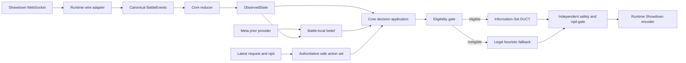
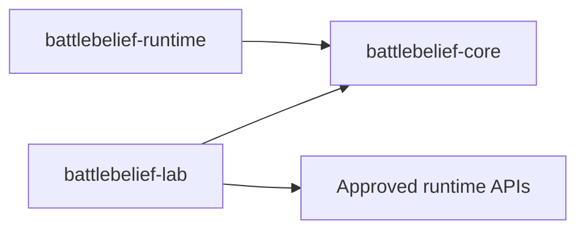

# Architecture

BattleBelief separates deterministic decision logic, live runtime adapters, and offline research tooling into three Python packages. This separation is both a design rule and a CI-enforced repository contract.

## System overview



The current M1 implementation covers the protocol-safe state, request, legal-action, deterministic-policy, battle-session, and command-dispatch portions. Belief and search shown in the diagram are later-milestone capabilities.

## Sources of truth

BattleBelief deliberately keeps two distinct authoritative inputs:

1. **Visible battle state:** canonical battle events reduced by the deterministic core reducer.
2. **Currently legal own actions:** the latest Showdown `request` payload and its `rqid`.

Belief and decision logic do not parse raw Showdown wire lines. The runtime adapter translates protocol input into canonical core objects.

## Package boundaries

```text
packages/
├─ battlebelief-core/
├─ battlebelief-runtime/
└─ battlebelief-lab/
```

Allowed dependency direction:



Rules:

- `battlebelief-core` imports neither runtime nor lab.
- `battlebelief-runtime` may import core, but never lab.
- `battlebelief-lab` may import core and approved runtime APIs.
- Private runtime CLI and composition modules are not lab APIs.

## `battlebelief-core`

The core is the pure deterministic decision system. Its responsibilities include:

- immutable canonical battle events;
- deterministic observed-state reduction;
- normalized decision requests;
- request reconciliation and freshness handling;
- safe submission sets;
- deterministic heuristic selection;
- engine eligibility, belief, and search abstractions for later milestones;
- independent action and `rqid` safety checks.

The core must not know about:

- WebSockets or raw Showdown lines;
- file paths or environment variables;
- SQLite, DuckDB, or PyArrow;
- concrete simulation engines;
- Node processes;
- PyTorch, ONNX Runtime, or CUDA;
- concrete logging systems;
- global clocks or random-number generators.

External effects are represented through explicit ports such as battle transport, transition models, meta-prior providers, evaluators, trace sinks, clocks, and random sources.

## `battlebelief-runtime`

The runtime package owns live and public adapters:

- Showdown frame decoding and protocol parsing;
- authenticated WebSocket connectivity;
- request decoding and command encoding;
- packed-team file loading;
- single-room battle sessions;
- direct-challenge coordination;
- CLI and public API composition;
- later engine, model-inference, SQLite-meta, and telemetry adapters.

The runtime translates between external systems and core contracts. It must not move domain truth or safety rules out of the core merely for convenience.

## `battlebelief-lab`

The lab package is reserved for offline research and validation:

- local Showdown oracle integration;
- replay mining and datasets;
- meta-prior construction;
- teacher generation and self-play;
- optional model training;
- ablations and sealed evaluation;
- research reporting;
- later offline team-building.

Lab code may reuse approved runtime adapters, but live runtime behavior must never depend on lab internals.

## Safety path

A candidate action is not sent directly to Pokémon Showdown. It must pass an independent final gate that verifies:

- the action belongs to the authoritative safe submission set;
- the request is still current;
- the `rqid` matches the request being answered;
- pending-state reconciliation permits a new submission;
- the command can be encoded without exposing secrets.

Unsupported or unavailable capabilities must fail closed to the legal heuristic fallback rather than silently entering an unqualified search path.

## Offline and live data flow

Planned offline flow:

```text
Replays, self-play, and curated data
→ versioned datasets
→ versioned meta-prior snapshot
→ evaluation and optional training
```

Planned live flow:

```text
Load immutable meta snapshot before battle
→ keep battle-local belief and search state in memory
→ emit provenance-bound decision records
```

Offline team-building is a later, separate subsystem. Teams remain fixed during each battle.

## Format scope

The architecture avoids unnecessary OU-specific coupling, but implementation and qualification currently target only Smogon Gen 9 OU Singles. A second real Singles format would require new ruleset, target-population, capability, and strength artifacts before any generalization claim.

Doubles and VGC are outside the current scope.
