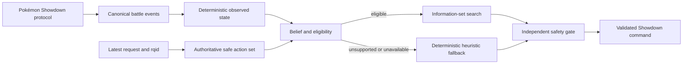

# BattleBelief

BattleBelief is an open-source Pokémon Singles research bot for decision-making under hidden information.

The project currently targets **Smogon Gen 9 OU** and studies whether an explicit open-world belief over complete hidden sets, combined with information-set search, can improve battle decisions under fixed CPU and reproducibility budgets. An independent action-safety gate separately preserves legal, request-bound execution.

> **Project status:** Milestone M1 is in progress. The repository contains the protocol-safe core, authenticated Pokémon Showdown connectivity, request-driven battle sessions, direct-challenge coordination, and a secrets-safe challenge CLI. Acceptance smoke tests, atomic version activation, and final M1 evidence are not complete. Battle strength, ladder parity, release readiness, and MVP status are not claimed.

## Start here

- [[Getting Started]] — requirements, installation, checks, and the current challenge command
- [[Architecture]] — packages, data flow, safety boundaries, and planned decision pipeline
- [[Current Status and Roadmap]] — implemented capabilities, limitations, and milestones
- [[Development and Contributing]] — repository workflow, tests, architecture rules, and contribution requirements
- [[Research, Scope, and Safety|Research-Scope-and-Safety]] — research thesis, supported scope, reproducibility, credentials, and non-goals

## Decision path

The runtime currently implements the protocol-safe and heuristic portions of this path. Belief, search, training, strength qualification, and broader validation belong to later milestones.

## Repository packages

| Package | Responsibility |
|---|---|
| `battlebelief-core` | Pure immutable domain and application logic, including events, state reduction, requests, reconciliation, deterministic policy, and safety |
| `battlebelief-runtime` | Public adapters and CLI, including Showdown framing, parsing, authentication, battle sessions, direct challenges, teams, and command encoding |
| `battlebelief-lab` | Offline oracle, datasets, replay mining, training, evaluation, and reporting for later milestones |

The package boundaries are intentional: core does not depend on runtime or lab; runtime may depend on core; lab may depend on core and approved runtime APIs.

## Important expectations

- A green `main` branch is an integration claim, not a strength or release claim.
- Teams are fixed before a battle. Offline team-building and in-battle decision-making are separate systems.
- The current supported target is Gen 9 OU Singles. Doubles and VGC are outside scope.
- Credentials, packed teams, private replay corpora, model weights, and unverified third-party code must not be committed.

## License and affiliation

Source code is licensed under Apache-2.0. Datasets and model artifacts may use separate licenses documented with those artifacts.

BattleBelief is an unofficial research project and is not affiliated with Nintendo, Game Freak, Creatures Inc., Smogon, or Pokémon Showdown.
